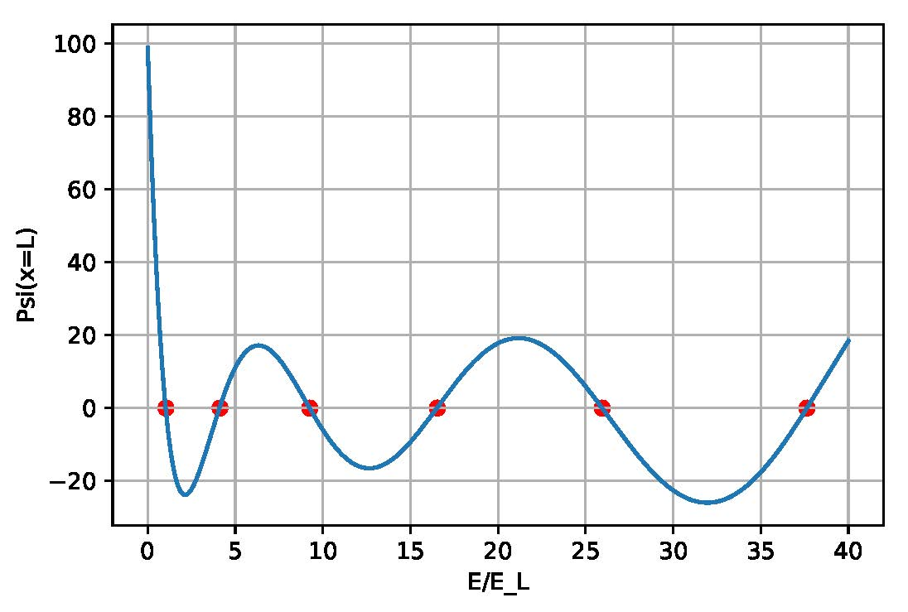

# Python-Projects
Solve Schroedinger equation for various potentials using Python

In this project, we numerically solve for the eigen-energies and wavefunctions for a particle in various potentials.
sch_1dwell2.py solves the 1D-infinite square-well potential. For more details, refer to the PDF file.

